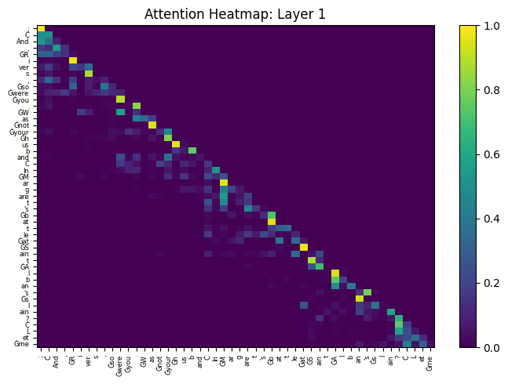

# COMS 4995 Applied Machine Learning Homework 3  
---

## Overview
--------
This project implements a minimal Transformer language model trained on the Tiny Shakespeare corpus for next-token prediction. 
The goal is to reproduce the core components of modern LLMs—tokenization, positional encodings, causal self-attention, and autoregressive generation—in a compact, educational setting.

---

## Model Architecture
A lightweight 2-layer Transformer with:

- BPE tokenizer (vocab size = 500)
- Token embeddings + sinusoidal positional encodings
- Single-head causal self-attention
- RMSNorm (pre-norm) + residual connections
- Position-wise feed-forward network (ReLU)
- Output projection to vocabulary logits

Training: cross-entropy loss, Adam (1e-3), batch size 128, context length 50, 50 epochs.

---

## Attention Heatmap
Even with a tiny model, clear patterns emerge:

- Layer 0: strongly diagonal (local context)
- Layer 1: broader, structured off-diagonal attention (longer-range mixing)

---

## Sample Generation
Despite its small size, the model captures Shakespeare-like stylistic cues.

Prompt: \
ROMEO:

Generated:
their bones \
kindle in your follower \
And blORK: \
For comes the very late; who, they say, or take \
to des
